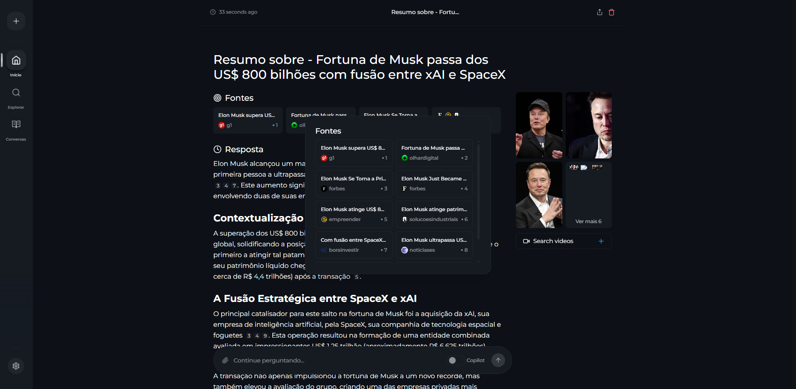
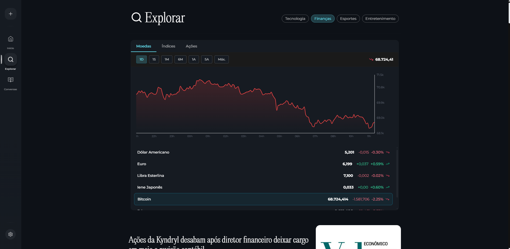

# 🚀 Perplexica Market BR - Motor de Busca com IA e Análise Financeira <!-- omit in toc -->

> **Versão Brasileira do Perplexica com Foco em Mercado Financeiro** - Um fork traduzido e aprimorado do [Perplexica](https://github.com/ItzCrazyKns/Perplexica), com recursos adicionais de análise financeira e gráficos interativos para o mercado brasileiro.

<div align="center" markdown="1">

[](https://github.com/ItzCrazyKns/Perplexica/stargazers)
[](LICENSE)
[](https://discord.gg/26aArMy8tT)

</div>

<hr/>



## 📋 Índice <!-- omit in toc -->

- [Sobre Este Projeto](#sobre-este-projeto)
- [O Que É o Perplexica](#o-que-é-o-perplexica)
- [Novidades da Versão Brasileira](#novidades-da-versão-brasileira)
- [Preview](#preview)
- [Recursos](#recursos)
- [Instalação](#instalação)
  - [Instalação com Docker (Recomendado)](#instalação-com-docker-recomendado)
  - [Instalação Sem Docker](#instalação-sem-docker)
  - [Solução de Problemas](#solução-de-problemas)
- [Usando como Motor de Busca](#usando-como-motor-de-busca)
- [Usando a API](#usando-a-api)
- [Contribuição](#contribuição)
- [Suporte](#suporte)
- [Licença](#licença)
- [Agradecimentos](#agradecimentos)

## 🇧🇷 Sobre Este Projeto

Este é um **fork brasileiro** do [Perplexica](https://github.com/ItzCrazyKns/Perplexica), desenvolvido por [ItzCrazyKns](https://github.com/ItzCrazyKns). Esta versão foi criada para atender especificamente o público brasileiro, com tradução completa da interface e recursos adicionais focados no mercado financeiro nacional.

### Créditos ao Projeto Original

Todo o código base e conceito inicial pertencem ao projeto [Perplexica](https://github.com/ItzCrazyKns/Perplexica) e seus colaboradores. Este fork mantém o espírito open-source do projeto original enquanto expande suas capacidades para o contexto brasileiro.

## 🔍 O Que É o Perplexica

Perplexica é um **motor de busca com IA focado em privacidade** que roda totalmente em seu próprio hardware. Ele combina conhecimento da vasta internet com suporte para **LLMs locais** (Ollama) e provedores em nuvem (OpenAI, Claude, Groq), entregando respostas precisas com **fontes citadas** mantendo suas buscas completamente privadas.

Quer saber mais sobre sua arquitetura e como funciona? Você pode ler [aqui](https://github.com/ItzCrazyKns/Perplexica/tree/master/docs/architecture/README.md).

## ✨ Novidades da Versão Brasileira

Esta versão inclui as seguintes melhorias e adições:

### 🌐 Tradução Completa
- ✅ Interface totalmente traduzida para português brasileiro
- ✅ Mensagens de sistema e notificações em português
- ✅ Documentação adaptada para o público brasileiro

### 📈 Gráficos Financeiros Integrados
- 📊 **Visualização de histórico de preços de ações** - Acompanhe a evolução de ações da B3 e mercados internacionais
- 💰 **Gráficos de criptomoedas** - Veja o histórico de preços de Bitcoin, Ethereum e outras criptomoedas
- 📉 **Análise técnica visual** - Gráficos interativos com dados históricos
- 🔄 **Atualização em tempo real** - Dados atualizados do mercado financeiro
- 🎯 **Seção de finanças dedicada** - Modo de foco especial para consultas financeiras com visualizações integradas

### 🇧🇷 Otimizações para o Brasil
- Melhor compreensão de termos e contextos brasileiros
- Suporte aprimorado para buscas em português
- Dados e informações relevantes ao mercado brasileiro

## 🎬 Preview



*Demonstração dos gráficos financeiros em ação*

## 🌟 Recursos

### Recursos Herdados do Perplexica Original

🤖 **Suporte para todos os principais provedores de IA** - Use LLMs locais através do Ollama ou conecte-se ao OpenAI, Anthropic Claude, Google Gemini, Groq e muito mais.

⚡ **Modos de busca inteligentes** - Escolha o Modo Balanceado para buscas do dia a dia, Modo Rápido quando precisar de respostas rápidas, ou aguarde o Modo Qualidade (em breve) para pesquisas profundas.

🎯 **Seis modos de foco especializados** - Obtenha melhores resultados com modos projetados para tarefas específicas:
- **Modo All:** Pesquisa toda a web para encontrar os melhores resultados
- **Modo Assistente de Escrita:** Útil para tarefas de escrita que não requerem pesquisa na web
- **Modo Pesquisa Acadêmica:** Encontra artigos e papers, ideal para pesquisa acadêmica
- **Modo Pesquisa YouTube:** Encontra vídeos do YouTube baseados na consulta
- **Modo Wolfram Alpha:** Responde consultas que precisam de cálculos ou análise de dados
- **Modo Pesquisa Reddit:** Pesquisa no Reddit por discussões e opiniões relacionadas

🔍 **Busca web powered by SearxNG** - Acesse múltiplos motores de busca mantendo sua identidade privada.

📷 **Busca de imagens e vídeos** - Encontre conteúdo visual além de resultados de texto.

📄 **Upload de arquivos** - Envie documentos e faça perguntas sobre eles. PDFs, arquivos de texto, imagens - Perplexica entende todos.

🌐 **Busca em domínios específicos** - Limite sua busca a websites específicos quando souber onde procurar.

💡 **Sugestões inteligentes** - Receba sugestões inteligentes de busca conforme você digita.

📚 **Descobrir** - Navegue por artigos interessantes e conteúdo em alta durante o dia.

🕒 **Histórico de buscas** - Cada busca é salva localmente para que você possa revisitar suas descobertas a qualquer momento.

### Recursos Exclusivos da Versão Brasileira

📊 **Gráficos Financeiros** - Visualização interativa de dados do mercado financeiro:
- Histórico de preços de ações (B3 e mercados internacionais)
- Gráficos de criptomoedas com dados em tempo real
- Análise técnica com indicadores visuais
- Interface em português com dados formatados para o Brasil

## 📥 Instalação

Existem principalmente 2 formas de instalar o Perplexica Market BR - Com Docker ou Sem Docker. Usar Docker é altamente recomendado.

### Instalação com Docker (Recomendado)

O Perplexica pode ser facilmente executado usando Docker. Simplesmente execute o seguinte comando:

```bash
docker run -d -p 3000:3000 -v perplexica-data:/home/perplexica/data -v perplexica-uploads:/home/perplexica/uploads --name perplexica-market-br itzcrazykns1337/perplexica:latest
```

Isso irá baixar e iniciar o container Perplexica com o mecanismo de busca SearxNG integrado. Uma vez em execução, abra seu navegador e navegue até http://localhost:3000. Você pode então configurar suas configurações (chaves API, modelos, etc.) diretamente na tela de configuração.

**Nota:** A imagem inclui tanto o Perplexica quanto o SearxNG, portanto nenhuma configuração adicional é necessária. As flags `-v` criam volumes persistentes para seus dados e arquivos enviados.

#### Usando com Sua Própria Instância SearxNG

Se você já possui o SearxNG em execução, pode usar a versão slim:

```bash
docker run -d -p 3000:3000 -e SEARXNG_API_URL=http://sua-url-searxng:8080 -v perplexica-data:/home/perplexica/data -v perplexica-uploads:/home/perplexica/uploads --name perplexica-market-br itzcrazykns1337/perplexica:slim-latest
```

**Importante:** Certifique-se de que sua instância SearxNG tenha:
- Formato JSON habilitado nas configurações
- Mecanismo de busca Wolfram Alpha habilitado

#### Configuração Avançada (Compilando do Código-Fonte)

Se você preferir compilar a partir do código-fonte:

1. Certifique-se de que o Docker está instalado e em execução no seu sistema.
2. Clone este repositório:

   ```bash
   git clone https://github.com/seu-usuario/perplexica-market-br.git
   cd perplexica-market-br
   ```

3. Compile e execute usando Docker:

   ```bash
   docker build -t perplexica-market-br .
   docker run -d -p 3000:3000 -v perplexica-data:/home/perplexica/data -v perplexica-uploads:/home/perplexica/uploads --name perplexica-market-br perplexica-market-br
   ```

4. Acesse o Perplexica Market BR em http://localhost:3000 e configure suas configurações.

### Instalação Sem Docker

1. Instale o SearXNG e permita o formato `JSON` nas configurações. Certifique-se de que o mecanismo de busca Wolfram Alpha também esteja habilitado.

2. Clone o repositório:
   ```bash
   git clone https://github.com/seu-usuario/perplexica-market-br.git
   cd perplexica-market-br
   ```

3. Instale as dependências:
   ```bash
   npm install
   ```

4. Compile a aplicação:
   ```bash
   npm run build
   ```

5. Inicie a aplicação:
   ```bash
   npm run start
   ```

6. Abra seu navegador e navegue até http://localhost:3000 para completar a configuração.

**Nota:** Usar Docker é recomendado pois simplifica o processo de configuração.

Veja a [documentação de instalação](https://github.com/ItzCrazyKns/Perplexica/tree/master/docs/installation) do projeto original para mais informações.

### Solução de Problemas

#### Servidores Locais Compatíveis com OpenAI-API

Se o Perplexica informar que você não configurou nenhum provedor de modelo de chat, certifique-se de que:

1. Seu servidor está rodando em `0.0.0.0` (não `127.0.0.1`) e na mesma porta que você colocou na URL da API.
2. Você especificou o nome correto do modelo carregado pelo seu servidor LLM local.
3. Você especificou a chave API correta, ou colocou algo no campo se a chave não for necessária.

#### Erros de Conexão Ollama

Se você estiver encontrando um erro de conexão Ollama:

1. **Verifique sua URL da API Ollama:** Certifique-se de que a URL da API está corretamente definida no menu de configurações.
2. **Atualize a URL da API com Base no SO:**
   - **Windows:** Use `http://host.docker.internal:11434`
   - **Mac:** Use `http://host.docker.internal:11434`
   - **Linux:** Use `http://<ip_privado_do_host>:11434`

3. **Usuários Linux - Exponha o Ollama para a Rede:**
   - Dentro de `/etc/systemd/system/ollama.service`, adicione `Environment="OLLAMA_HOST=0.0.0.0:11434"`
   - Recarregue a configuração: `systemctl daemon-reload`
   - Reinicie o Ollama: `systemctl restart ollama`
   - Certifique-se de que a porta não está bloqueada pelo firewall

Para mais detalhes de solução de problemas, consulte a [documentação original](https://github.com/ItzCrazyKns/Perplexica).

## 🔍 Usando como Motor de Busca

Para usar o Perplexica Market BR como motor de busca padrão do seu navegador:

1. Abra as configurações do seu navegador
2. Navegue até a seção 'Motores de Busca'
3. Adicione uma nova busca de site com a URL: `http://localhost:3000/?q=%s`
4. Substitua `localhost` pelo seu IP ou domínio se não estiver hospedado localmente
5. Agora você pode usar o Perplexica Market BR diretamente da barra de pesquisa!

## 🔌 Usando a API

O Perplexica Market BR mantém toda a funcionalidade da API do projeto original. Você pode executar buscas, usar múltiplos modelos e obter respostas para suas consultas.

Para mais detalhes, confira a [documentação completa da API](https://github.com/ItzCrazyKns/Perplexica/tree/master/docs/API/SEARCH.md).

## 🤝 Contribuição

Contribuições são bem-vindas! Se você encontrou bugs, tem ideias para melhorias ou quer adicionar novos recursos voltados para o público brasileiro:

1. Faça um fork do projeto
2. Crie uma branch para sua feature (`git checkout -b feature/NovaFuncionalidade`)
3. Commit suas mudanças (`git commit -m 'Adiciona nova funcionalidade'`)
4. Push para a branch (`git push origin feature/NovaFuncionalidade`)
5. Abra um Pull Request

### Contribuindo para o Projeto Original

Se você desenvolver melhorias que possam beneficiar o projeto original Perplexica, considere contribuir também para o [repositório upstream](https://github.com/ItzCrazyKns/Perplexica).

## 💬 Suporte

Se você tiver alguma dúvida ou feedback sobre esta versão brasileira:

- Abra uma [issue](https://github.com/seu-usuario/perplexica-market-br/issues) neste repositório
- Entre no [servidor Discord](https://discord.gg/EFwsmQDgAu) do projeto original
- Para questões específicas da versão brasileira, use as issues deste repositório

## 📄 Licença

Este projeto mantém a mesma licença MIT do [Perplexica original](https://github.com/ItzCrazyKns/Perplexica/blob/master/LICENSE).

```
MIT License

Copyright (c) 2025 - Perplexica Market BR (Fork)
Copyright (c) 2024 - ItzCrazyKns (Projeto Original)
```

## 🙏 Agradecimentos

### Ao Projeto Original
- **[ItzCrazyKns](https://github.com/ItzCrazyKns)** - Criador do Perplexica
- Toda a **[comunidade Perplexica](https://github.com/ItzCrazyKns/Perplexica/graphs/contributors)** - Pelos contribuidores incríveis
- **[Warp Terminal](https://www.warp.dev/perplexica)** - Pelo patrocínio ao projeto original

### Tecnologias Utilizadas
- [Next.js](https://nextjs.org/) - Framework React
- [SearxNG](https://github.com/searxng/searxng) - Meta motor de busca
- [Ollama](https://ollama.ai/) - Execução de LLMs locais
- [TailwindCSS](https://tailwindcss.com/) - Framework CSS

### Comunidade Open Source
Agradecimento especial a toda comunidade open source que torna projetos como este possíveis! 🚀

---

<div align="center">

**⭐ Se este projeto foi útil para você, considere dar uma estrela!**

**🔗 Não se esqueça de também apoiar o [projeto original](https://github.com/ItzCrazyKns/Perplexica)!**

---

Feito com ❤️ para a comunidade brasileira | Baseado no incrível [Perplexica](https://github.com/ItzCrazyKns/Perplexica)

</div>